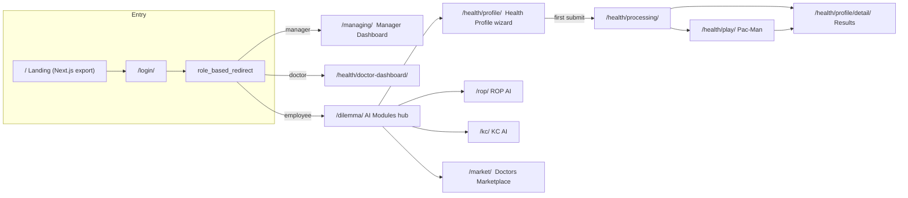
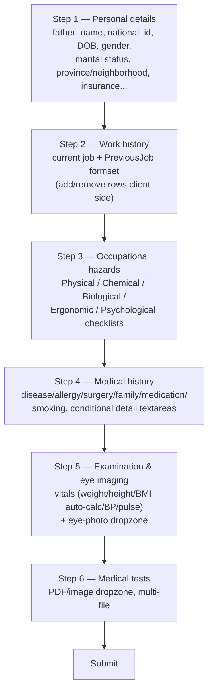
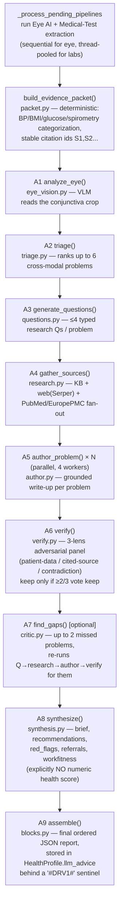
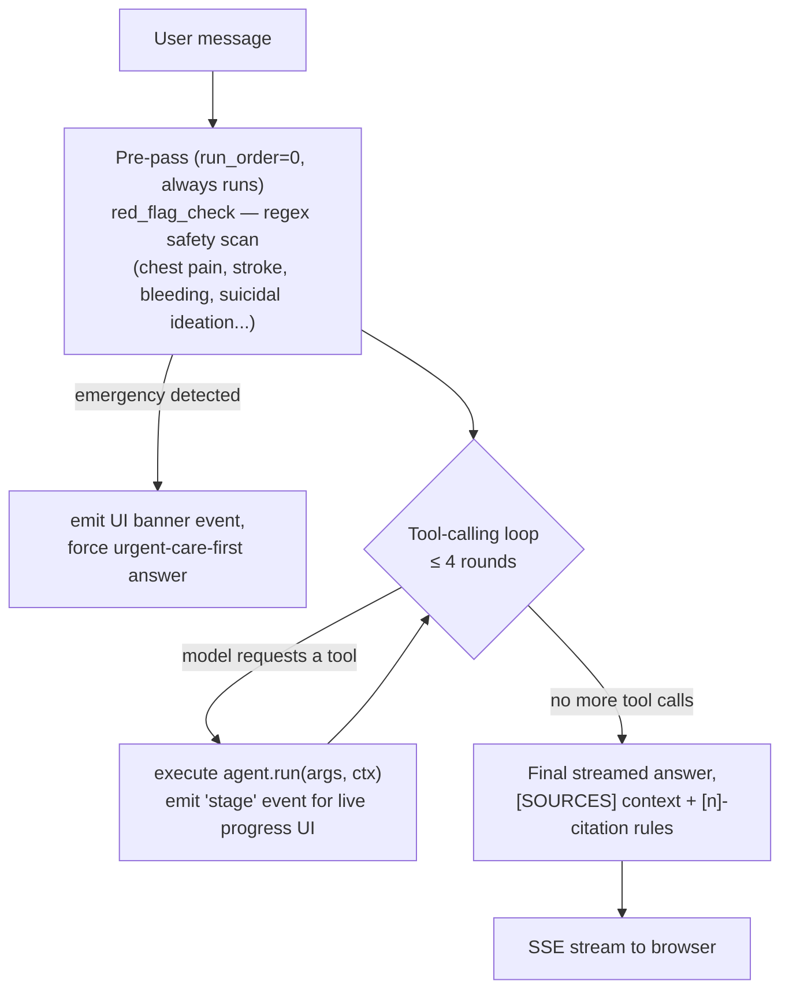

# MediverseAI — End-to-End Service Report

**Scope:** Full walkthrough of the occupational-health platform served by this Django project, starting from account registration, through the manager and doctor dashboards, into the employee "Health Profile" flow at `/dilemma/` → `/health/profile/`, the AI pipelines that process it, the results page, and every chatbot in the system — with the software design, AI/agent architecture, models, frameworks and RAG systems behind each piece.

**How to read this document:** every section names the exact file(s) it describes (`path/to/file.py:line`) so any claim here can be jumped to directly in the codebase. Mermaid flowcharts are used where the control flow is non-trivial (GitHub, GitLab and most Markdown viewers render `mermaid` fenced blocks natively).

---

## Table of Contents

1. [System Map](#1-system-map)
2. [Roles & Registration](#2-roles--registration)
3. [Manager Dashboard](#3-manager-dashboard)
4. [Doctor Dashboard](#4-doctor-dashboard)
5. [Employee Hub (`/dilemma/`) & the Health Profile Wizard](#5-employee-hub-dilemma--the-health-profile-wizard)
6. [After Submission: the Deep Health Research Pipeline](#6-after-submission-the-deep-health-research-pipeline)
7. [The Waiting-Room Minigame](#7-the-waiting-room-minigame)
8. [The Results Page](#8-the-results-page)
9. [Chatbots, Role by Role](#9-chatbots-role-by-role)
10. [ROP AI & KC AI — Standalone Diagnostic Modules](#10-rop-ai--kc-ai--standalone-diagnostic-modules)
11. [Doctors Marketplace — the 13-Agent Consultation Product](#11-doctors-marketplace--the-13-agent-consultation-product)
12. [AI / ML Model Inventory](#12-ai--ml-model-inventory)
13. [RAG Systems Inventory](#13-rag-systems-inventory)
14. [Software Architecture, Infra & Frontend](#14-software-architecture-infra--frontend)
15. [Known Gaps, Dead Code & Caveats](#15-known-gaps-dead-code--caveats)

---

## 1. System Map

The project is a single Django 5.1 monolith (`config/`) composed of five apps, each mounted at a distinct URL prefix (`config/urls.py:10-28`):

| Prefix | App | Purpose |
|---|---|---|
| `` (root) | `usac` | Landing page, auth, role-based signup, manager dashboard, employee hub (`/dilemma/`) |
| `health/` | `test_analysis` | Employee Health Profile wizard, doctor dashboard, AI report pipeline, in-page chatbots |
| `rop/` | `single_rop` | "ROP AI" — Retinopathy of Prematurity image diagnosis |
| `kc/` | `double_rop` | "KC AI" — Keratoconus dual-eye image diagnosis |
| `market/` | `doctors_marketplace` | "Doctors Marketplace" — multi-agent AI consultation product |
| `chat*` (root) | `single_rop` views | In-process ROP knowledge-base chatbot (separate from the above) |
| `accounts/` | `allauth` | Google social login |
| `admin/` | custom Jazzmin `AdminSite` | Django admin |

Every one of these apps runs its own LLM-backed features against the same GAPGPT (OpenAI-compatible proxy) account, but each was built with a slightly different pattern — raw OpenAI SDK tool-calling, LangChain+FAISS RAG, or deterministic Python — documented per-section below.



---

## 2. Roles & Registration

### 2.1 The three roles

Roles are **not** a custom Django user model — they're a plain `UserProfile.role` field layered on top of the default `auth.User` (`usac/models.py:17-33`):

```python
ROLE_MANAGER = 'manager'
ROLE_DOCTOR  = 'doctor'
ROLE_EMPLOYEE = 'employee'
```

`UserProfile` also carries `national_code`, `company` (FK to `Company`), `phone`, and (added during this engagement) `examination_type` (Pre-Employment / Periodic / Return-to-Work, employees only). `Company` (`usac/models.py:8-15`) is a `manager`-owned org record (name, address, email, phone).

### 2.2 Sign-up flow

`usac/urls.py:22-25`:

```
/signup/choose-role/   → choose_role_view          (usac/views.py:346-360)
/signup/manager/       → signup_manager_view        (usac/views.py:363-372)
/signup/doctor/        → signup_doctor_view         (usac/views.py:375-376)
/signup/employee/      → signup_employee_view       (usac/views.py:379-380)
```

**Step 1 — choose a role** (`templates/usac/signup_choose_role2.html`): a `RoleChoiceForm` (`usac/forms.py:15-20`) rendered as three big radio cards (Manager / Doctor / Employee). Submitting redirects to the role-specific form.

**Step 2a — Manager** (`templates/usac/signup_manager2.html`, form `ManagerSignupForm`, `usac/forms.py:23-89`) — a `UserCreationForm` subclass. Fields:

| Field | Purpose |
|---|---|
| `username`, `password1`, `password2` | Django auth account |
| `email`, `phone` | Manager contact |
| `company_name` | Must be globally unique (case-insensitive check, `forms.py:57-62`) |
| `company_address`, `company_email`, `company_phone` | Org record |

`.save()` (`forms.py:64-89`) creates the `User`, a `UserProfile(role='manager')`, and a brand-new `Company` with `manager=user` in one transaction-like sequence — **the manager is always the one who creates the company**; there's no "join an existing company as manager" path.

**Step 2b — Doctor / Employee** (`templates/usac/signup_staff2.html`, shared form `StaffSignupForm`, `usac/forms.py:92-154`), role injected by the view. Fields: `username`, `email`, `phone`, `national_code` (exactly 10 digits, `clean_national_code`), `password1`, `password2`.

Doctors and employees **cannot self-register into a company** — `clean()` (`forms.py:127-138`) requires a matching, unused `Invitation` row (`company`, `national_code`, `role`, `used_by__isnull=True`) created beforehand by a manager (see §3.2). If none exists: *"No active invitation found for this national code. Please contact your company manager."* On success, `.save()` (`forms.py:140-154`) creates the `User` + `UserProfile`, copies `company` **and `examination_type`** from the matched `Invitation`, and calls `inv.mark_used(user)` (`usac/models.py:47-50`).

### 2.3 Login

Two coexisting mechanisms:
- **Primary/custom** — `usac.views.custom_login` (`usac/views.py:98-125`), a hand-rolled `authenticate()`/`login()` view backing `templates/usac/login2.html`, mounted at `/login/` and set as `LOGIN_URL` (`config/settings.py:171`, explicitly commented "not allauth's default"). Redirects by role after success.
- **Google OAuth** — `django-allauth` mounted at `/accounts/` (`config/urls.py:12`), `SOCIALACCOUNT_PROVIDERS["google"]` (`config/settings.py:225-233`). Lands back through the same `role_based_redirect` (`usac/views.py:32-38`).

`role_based_redirect` sends managers → `/managing/`, doctors → `/health/doctor-dashboard/`, everyone else → `/dilemma/`.

---

## 3. Manager Dashboard

**URL:** `/managing/` → `manager_dashboard` (`usac/views.py:398+`), template `templates/usac/manager_dashboard2.html`. Guarded by `@user_passes_test(is_manager)`.

### 3.1 Inviting doctors and employees

The "Invite a team member" card posts `national_code`, `invite_role` (`employee`/`doctor`), and — only for employees — `examination_type` back to the same URL (`usac/views.py:436-465`). A small inline script toggles the examination-type `<select>` on/off based on the chosen role. Server-side: validates the national code is 10 digits, `add_role` is a valid role, and (employees only) `examination_type` is one of `pre_employment`/`periodic`/`return_to_work`; then `Invitation.objects.get_or_create(company, national_code, defaults={role, examination_type})`, updating role/exam-type in place if the code was already invited. This is exactly the record `StaffSignupForm` looks up at sign-up time (§2.2) — **inviting is nothing more than pre-registering a national code against a company/role/exam-type**, the actual account is created by the invitee themselves.

### 3.2 KPI tiles

Nine tiles total (`manager_dashboard2.html:276-311`, data computed in `usac/views.py:467-553`):

| Tile | Source |
|---|---|
| Doctors / Employees counts | `User.objects.filter(profile__company=company, profile__role=...)` |
| Pending invitations | `Invitation.objects.filter(company=company, used_by__isnull=True)` |
| Assessed employees | `HealthProfile` rows with any of `opinion_fit`/`opinion_fit_with_conditions`/`opinion_unfit` = True |
| Abnormal lab results | Employees with ≥1 `MedicalTest(status=done, abnormal_count__gt=0)` |
| Anemia flags (AI screening) | Employees with `EyeAnalysis(status=done, anemia_label='positive')` |
| Pending doctor review | `HealthProfile` rows with **no** opinion set yet, plus the oldest one's age in days |

### 3.3 Charts — "Workforce health overview" & "Compliance & screening"

Five Chart.js visualizations, deliberately varied in form (not all doughnuts/bars):

| Chart | Type | Data |
|---|---|---|
| BMI distribution | Horizontal bar | WHO bins (Underweight/Normal/Overweight/Obese/Unknown) from `HealthProfile.bmi` |
| Health risks | Radar | Diabetes / Smoking / BP-medication prevalence |
| Medical opinion | Single 100%-stacked bar | Fit / Conditional / Unfit / Unspecified proportion |
| Occupational hazard exposure | Polar area | Employees exposed to each of the 5 hazard categories (physical/chemical/biological/ergonomic/psychological) |
| Examination type | Grouped vertical bar | Pre-Employment / Periodic / Return-to-Work / Unassigned employee counts |

All computed in `usac/views.py:467-553`, rendered via `Chart.js` in `manager_dashboard2.html:560-680`, theme-aware (light/dark CSS custom properties).

### 3.4 Tables & access to other pages

- **Invitations** table — national code, role, examination type, created date, used/pending status.
- **Doctors** table, **Employees** table (with client-side search) — each row links to **`/managing/member/<user_id>/`** (`member_detail_view`, `usac/views.py:582-621`) — a manager-only drill-down showing the member's `HealthProfile`, their `PredictionLog` (ROP) / `PredictionResult` (KC) history, and, for doctors, their own examined-employee stats.
- The manager also reaches, indirectly, **every employee's full Health Profile results page** via the "Clinician/Manager Workspace" (see §8) embedded in `/health/profile/detail/<user_id>/`, where they can record the *same* final opinion / referrals a doctor can (`test_analysis/views.py:360-366`: `can_edit_doctor_notes` is `True` for any manager).
- From the shared top-nav dropdown, managers can jump back to `/dilemma/` (which auto-redirects managers straight back to `/managing/`, `usac/views.py:143-145`).

---

## 4. Doctor Dashboard

**URL:** `/health/doctor-dashboard/` → `doctor_dashboard` (`test_analysis/views.py:483-514`), template `templates/test_analysis/doctor_dashboard.html`. Manual role check (`request.user.profile.role != ROLE_DOCTOR` → 403), scoped to `request.user.profile.company`.

- **KPIs:** Total employees, Examined by you (`HealthProfile.objects.filter(examining_doctor=request.user)`), Completed exams, Pending review.
- **Employees table:** Employee / Full name / National code / Job title / **Examination type** / Assessment / Opinion / Actions. The Actions cell has three buttons — **ROP** and **KC** (secondary style) link into `single_rop`/`double_rop`'s review mode (`?employee=<id>`, see §10), **View record** (primary CTA) links into `/health/profile/detail/<id>/`.
- Doctors reach the **same results page** as employees/managers (`profile_detail_view`), but with `can_edit_doctor_notes=True` (same-company doctor, not viewing self) — unlocking the exam-notes/opinion/referrals workspace (§8) and the doctor-facing chat sidebar (§9.2–9.3).

---

## 5. Employee Hub (`/dilemma/`) & the Health Profile Wizard

### 5.1 `/dilemma/` — the "AI Modules" hub

`dilemma_view` (`usac/views.py:132-153`) immediately redirects managers/doctors to their own dashboards; everyone else sees `templates/usac/dilemma2.html` — a card grid linking to:

- **ROP AI** (`/rop/`) — retinal-image Retinopathy-of-Prematurity screening
- **KC AI** (`/kc/`) — dual-eye Keratoconus screening
- **Doctors Marketplace** (`/market/`) — AI specialist consultation
- **Health Profile** (`/health/profile/`) — the occupational-medicine exam form (this section's focus)
- Manager Panel / Doctor Panel cards, shown conditionally by role
- **Doctors Studio**, superuser-only

### 5.2 The wizard — `create_or_update_health_profile`

`test_analysis/views.py:99-205`, url name `create_update_profile`, template `templates/test_analysis/profile_form2.html`. Restricted to `ROLE_EMPLOYEE`/`ROLE_DOCTOR`.

It is **one Django form + two formsets inside a single `<form>`**, split into a **6-step client-side JS wizard** (all steps live in the DOM; JS toggles visibility, `profile_form2.html:652-706`) — not a server-side `django-formtools` wizard, so validation happens all at once on final submit.



**Form:** `EmployeeProfileForm` (`test_analysis/forms.py:122-230`), a `ModelForm` on `HealthProfile` covering personal info, current job, all 5 hazard categories, and full medical/personal/family history, plus exam vitals (`exam_date/weight/height/bmi/systolic/diastolic/pulse`). Province/neighborhood/insurance are constrained `<select>`s from `test_analysis/constants.py`. A model-tier selector in the topbar (Cloud GPT-4o-mini vs. local Llama 3.2) is captured into `HealthProfile.model_used_for_advice` — **note:** this selector has no effect on which model actually generates the report today (see §6.2, §15).

**Previous jobs:** `PreviousJobFormSet` (`forms.py:296-301`, prefix `jobs`) — add/remove rows via a cloned `<template>` element.

**Eye images** and **medical test files** are plain multipart inputs (`name="eye_images"`, `name="medical_test_files"`, both multiple) — not ModelForm fields. They're read via `request.FILES.getlist(...)` and handled by two dedicated helpers:

- `_save_eye_images()` (`views.py:253-281`) — SHA-256-hashes each file (`_file_hash`, `views.py:208-218`), **skips exact duplicates already on the profile**, creates one `EyeImage` row per new file.
- `_save_medical_tests()` (`views.py:221-250`) — identical dedup pattern, creates one `MedicalTest` row per new file.

On the initial wizard submission both helpers are called with `enqueue=False` — **no Celery dispatch here**; the actual AI processing (segmentation, anemia classification, lab-panel extraction) is deferred and run **inside the Deep Research background thread** (§6) so it can gate report generation. A separate view, `upload_eye_scan` (`views.py:284-309`, url `upload_eye_scan`), lets an employee add eye photos *after* their profile already exists, and **does** dispatch real Celery tasks (`enqueue=True`) since there's no report-generation gate to wait for at that point.

**Editability lock:** once a doctor has written *any* exam note or set an opinion, `_can_employee_edit()` (`views.py:56-82`) returns `False` and the employee can no longer edit their own submission — they're redirected to the read-only results page.

**Redirect after submit:** first-ever submission → `/health/processing/` (§7); subsequent edits → straight to the results page.

---

## 6. After Submission: the Deep Health Research Pipeline

### 6.1 Trigger

Immediately after saving the form, `views.py:172-173`:

```python
from .services.deep_research import runner as dr_runner
dr_runner.start(profile.id)
```

`runner.start()` (`test_analysis/services/deep_research/runner.py:245-253`) spawns a **daemon `threading.Thread`** — **no Celery** for the pipeline itself (Celery is reserved for the two narrower sub-tasks below). Progress is tracked in the **Django cache** (not the DB), key `deepresearch:progress:{profile_id}`, 30-minute TTL (`runner.py:33-67`), polled by the frontend.

### 6.2 Nine-stage multi-agent pipeline (`test_analysis/services/deep_research/`)



Every stage talks to an OpenAI-compatible **GAPGPT** endpoint via a thin JSON-forcing client (`services/deep_research/tools/llm_json.py`, `response_format={"type":"json_object"}`, retried up to 3×). Three model-tier env vars exist (`SYNTH_MODEL`, `REASONING_MODEL`, `VISION_MODEL`) but **all default to `gpt-4o-mini`** — so in the current deployment every stage, including the "vision" one, runs the same model unless overridden.

**Evidence Packet (`packet.py`)** is the key design choice that keeps the LLM stages *grounded*: every clinically salient number is pre-categorized in deterministic Python (ACC/AHA 2017 BP thresholds, WHO BMI bins, ADA glucose thresholds, FEV1/FVC obstructive-pattern check) **before** any LLM sees it, and each fact gets a stable citation id (`S1`, `S2`, …) that doubles as a `type:"patient"` source in the final report — the LLM is only ever asked to *interpret*, never to *calculate*.

**Verification (`verify.py`)** is an adversarial-panel pattern: each authored "problem" write-up is checked from 3 independent lenses (does the patient's own data support it? do the cited sources support it? is anything self-contradictory?) run concurrently, and a finding survives only with a majority vote — findings that fail are dropped from the report entirely rather than shown with a low confidence badge.

### 6.3 Sub-pipelines run inside the same thread

**Eye AI** (`test_analysis/services/eye_pipeline.py`) — see full model detail in §12. Two-phase U-Net segmentation (Simple U-Net, ResNet-34 encoder) + an EfficientNet-B0 binary anemia classifier running on the phase-1 crop. Run **sequentially** across images inside the Deep Research thread (torch model singletons aren't thread-safe to build concurrently) — or asynchronously via Celery (`analyze_eye_image_task`, `test_analysis/tasks.py:46-56`) when photos are added later via `upload_eye_scan`.

**Medical-test extraction** (`test_analysis/services/medical_test_extraction.py`) — GAPGPT `gpt-4o-mini` reads each uploaded lab report. PyMuPDF pulls embedded PDF text when present (cheap path); if the PDF is a scan (no embedded text) or the upload is an image, pages/images are rasterized/downscaled (PyMuPDF + Pillow) and sent to the **multimodal** model directly — no OCR library involved. Output JSON: `{report_type, lab_name, specimen, panels:[{name, analytes:[{name, result, flag, unit, reference}]}], summary}`; `abnormal_count` is a straight pass-through count of analytes the LLM flagged, not a Python-side reference-range comparison. Run in a small `ThreadPoolExecutor` (≤3 workers) inside the Deep Research thread, or via Celery (`extract_medical_test_task`) on post-hoc uploads.

### 6.4 Report shape

Final JSON (`blocks.py:19-80`): `masthead → brief → keyvitals → figure_eye → finding×N → recommendations → redflags → workfitness → referrals → labs_pointer`, plus a `sources` array and a `trail` (counts of findings/questions/sources, reviewer count, critic rounds). Stored directly inside the existing `HealthProfile.llm_advice` text column (prefixed `"#DRV1#\n"`) — no schema migration was needed; legacy plain-markdown reports (pre-dating this pipeline) are still readable since they lack the sentinel.

### 6.5 Status polling

`report_status` (`test_analysis/views.py:443-473`, url `health_processing_status`) returns `{ready, eye_ready, error, error_msg, detail_url}` as plain JSON, polled every few seconds by both the processing page and the minigame page. `eye_ready` is computed independently of the full `ready` flag so the UI *could* surface eye results early — see §15 for a caveat on this wiring.

---

## 7. The Waiting-Room Minigame

Because the Deep Research pipeline (multi-stage LLM fan-out + sequential eye-AI + lab extraction) can take anywhere from tens of seconds to a couple of minutes, the app gives the employee something to do instead of a bare spinner.

- **`/health/processing/`** (`processing_page`, `test_analysis/views.py:443-450`, template `processing2.html`) — a status card that polls `report_status` every ~5s and offers a **"Play a game while you wait"** link.
- **`/health/play/`** (`minigame_page`, `views.py:476-479`, url `health_minigame`, template `test_analysis/minigame.html`) — a full, playable **Pac-Man** clone embedded via `<iframe src="">` (a third-party open-source JS Pac-Man implementation dropped into `static/pacman/` — not a custom-built game), with the same 5-second status poll running underneath the game; once the report is ready, a "View report" button lights up.

Both pages poll the exact same `report_status` endpoint, so the user can bounce between "watch the status bar" and "play Pac-Man" without losing progress.

---

## 8. The Results Page

**URL:** `/health/profile/detail/` (own profile) or `/health/profile/detail/<user_id>/` (viewing an employee) → `profile_detail_view` (`test_analysis/views.py:318-440`), template `templates/test_analysis/profile_detail2.html` (2,720 lines). Access: self, or same-company doctor, or the company's manager — else `403`.

Rendered sections, top to bottom:

1. **Hero card** — avatar, name, job title/marital-status/children chips.
2. **AI Analysis** (`#ai-analysis`) — the Deep Research report, embedded as JSON (`{{ deep_report|json_script:"dr-data" }}`) and rendered client-side by a small block-dispatch renderer keyed on each block's `type` (brief / keyvitals / figure_eye / finding / recommendations / redflags / workfitness / referrals / labs_pointer). Falls back to legacy markdown via `markdown2` if no structured report exists yet.
3. **Personal & Occupational Details** — personal info, current + previous jobs.
4. **Occupational Hazards** — every `True` hazard flag across the 5 categories, plus free-text "other" notes.
5. **Medical & Clinical History** + **Paraclinical** (spirometry interpretation, ECG, chest X-ray findings).
6. **Eye Screening — AI Analysis** (`#eye-screening`) — per uploaded photo: a 3-up figure strip (Original / Phase-1 conjunctiva crop / Phase-2 palpebral crop) plus a verdict card (red "Signs of anemia detected" vs. green "No signs of anemia", with the classifier's confidence score), naming the EfficientNet-B0 + Simple U-Net pipeline explicitly.
7. **Medical Tests — AI Extraction** (`#medical-tests`) — per uploaded report: abnormal-count badge, LLM summary, and one rendered HTML table per lab panel (Analyte / Result / Flag / Unit / Reference, abnormal rows highlighted).
8. **Examination Summary** — vitals + the 12 body-system exam notes (only non-empty ones shown).
9. **Final Opinion & Referrals** (`#final-opinion`) — Fit / Conditional (+details) / Unfit (+reason) verdict, medical recommendations, and the doctor-entered `Referral` rows (distinct from the AI's own advisory referral suggestions inside the Deep Research report).
10. **Clinician/Manager Workspace** — *only shown to doctors/managers with edit rights* — the actual `DoctorNotesForm` (12 exam-note textareas grouped into 6 body-system cards, an opinion radio picker, conditional detail fields) plus the `ReferralFormSet`. This form POSTs back to this same view.
11. **Sticky assistant sidebar** — role-differentiated chat (see §9).

---

## 9. Chatbots, Role by Role

All three of the following live in **`test_analysis/health_chat_agent.py`** (1,971 lines), which uses the **raw OpenAI Python SDK** against GAPGPT (`gpt-4o-mini` by default) — **not** LangChain — and is entirely **non-streaming** on the backend (any "typing" effect the user sees is a client-side JS typewriter simulated after the full response arrives).

### 9.1 Employee "Finder" bot — `chat_with_assistant()`

Shown on the results page sidebar when the viewer **cannot** edit doctor notes (i.e., an employee viewing their own profile). Endpoint: `/health/chat/health-chat/` (`health_chat_api`, `test_analysis/views.py:588-615`, `@login_required`, no extra role gate).

- **System prompt** (`health_chat_agent.py:1121-1123`) instructs the bot, in Persian, to greet the user, confirm province/neighborhood/insurance, and use its tools to find doctors/medications/pharmacies.
- **Tools:**
  - `doctors_finder_tool` (`health_chat_agent.py:1162-1179`, executor `144-160`) — scrapes **nobat.ir** (or **doctoreto.com** if insurance is given) for the top doctors matching province/neighborhood/specialty, via `requests` + BeautifulSoup, and builds a reservation link.
  - `medications_finder_tool` (`1180-1197`, executor `162-329`) — drives **Selenium headless Chrome** against **darooyab.ir** to find pharmacy stock/price for named medications.
- Flow: first completion call with `tools=` → if the model calls a tool, execute it, feed the result back, and get a second, tool-free completion for the final natural-language reply; the *full* tool result is returned separately and rendered as HTML result cards (not spoken by the model).
- **Current limitation worth knowing:** the system prompt is templated with `disease_results`/`personal_information` that are **hardcoded module-level constants** (`health_chat_agent.py:1125-1139`) rather than the logged-in employee's real `HealthProfile`/AI results — this bot is functionally a working prototype not yet wired to live per-user data.

### 9.2 Doctor/Manager "form-filling" bot — `doctor_assist_assistant()`

Shown on the results page sidebar to whoever has `can_edit_doctor_notes=True`. Endpoint: `/health/chat/doctor-assist/` (`doctor_assist_api`, `views.py:851-895`; permission via `_can_user_edit_doctor_notes`).

- **Grounding:** `_build_profile_context()` (`views.py:634-848`) builds a large, real, Persian-language structured dump of the target employee's *actual* `HealthProfile` — personal info, hazards, history, vitals, exam notes, spirometry/ECG/CXR, `MedicalTest` panels, `EyeAnalysis` result, prior `Referral`s, and a truncated `llm_advice` snippet — this is genuine per-patient grounding (not RAG/vector search, just a complete deterministic serialization).
- **Two modes**, spelled out explicitly in the system prompt (`health_chat_agent.py:1343-1420`):
  - **Full-draft mode** — generic instruction like "fill the file" → drafts every exam-note field + opinion + recommendations.
  - **Targeted mode** — a specific instruction like "note the lesion found on the neck" → drafts *only* that field, sets `requires_approval=true`, and returns an `approval_prompt_text` the UI shows as an amber approve/cancel card before anything is applied.
- **No server-side write tool.** The model is forced into **strict JSON output** (`response_format={"type":"json_object"}`, no `tools=` at all) — "filling fields" is implemented **entirely client-side**: JS (`profile_detail2.html:2171-2268`) looks up each target field by its Django-generated DOM id (`id_<field_name>`) and types the proposed value into it character-by-character. Nothing is written to the database until the doctor reviews and submits the normal HTML form. The frontend also detects Persian/English approval keywords ("بله", "تایید", "ok", "yes", …) so a doctor can approve a targeted suggestion just by replying naturally.
- Referral suggestions are matched against existing formset rows by fuzzy specialty name, or a brand-new formset row is cloned in via JS (`addReferralRow()`), correctly bumping the Django management-form `TOTAL_FORMS` counter.
- Server-side dedup: a Python set (`seen_specs`, `health_chat_agent.py:1528-1546`) drops duplicate-specialty referrals as a second line of defense on top of the prompt-level instruction not to re-suggest an existing referral.

### 9.3 Doctor/Manager "research" bot — `doctor_research_chat()`

**Not** on the Health Profile results page — this one is wired into the **ROP/KC screening review pages** (`single_rop`/`double_rop`, see §10) when a doctor/manager reviews an employee's eye-screening case. Endpoint: `/health/chat/doctor-research/` (`doctor_research_api`, `views.py:898-936`), explicitly role-gated (`403` for employees).

- **True tool-calling RAG loop**, bounded at `MAX_ROUNDS = 4` (`health_chat_agent.py:1922`), with 5 tools: `search_knowledge_base` (local FAISS KB shared with the ROP chatbot), `search_web` (Serper), `fetch_url`, `search_pubmed` (direct NCBI E-utilities), `medication_lookup` (darooyab.ir classification lookup). All tool calls in a turn are executed (unlike the employee bot, which only ever handles the first).
- Sources are numbered and deduped (`_dr_register_sources`, `health_chat_agent.py:1856-1866`), and the system prompt (`DOCTOR_RESEARCH_SYSTEM_PROMPT`, `1575-1600`) enforces inline `[n]` citations on every clinical claim, refuses to invent citations, and always factors in the passed-in case context.

### 9.4 Doctors Marketplace chat — the 13-agent consultation product

A structurally different, much larger chat system — full detail in §11. In short: persisted conversations (`ChatMessage` model, with `sources`/`reply_to` for quote-reply/edit-fork), true **SSE streaming**, a **per-assistant configurable agent roster** (0–13 tools an admin picks in Doctors Studio), and an optional **3D TalkingHead avatar** with real-time lip-sync.

### 9.5 Summary table

| Bot | Page | Framework | Streaming | Tools | Persistence |
|---|---|---|---|---|---|
| Employee finder | Health Profile results | Raw OpenAI SDK | Client-side typewriter only | 2 (doctors/meds finder) | `localStorage` only |
| Doctor/Manager form-filler | Health Profile results | Raw OpenAI SDK, forced JSON | Client-side typewriter only | 0 (JSON output, client applies it) | `localStorage` only |
| Doctor/Manager research | ROP/KC review pages | Raw OpenAI SDK | Non-streaming JSON | 5 (KB/web/URL/PubMed/meds) | `localStorage` only |
| Marketplace assistant | `/market/` | Raw OpenAI SDK (GAPGPT `gpt-5-nano`) | True SSE | 0–13, per-assistant | Postgres (`ChatMessage`) |

---

## 10. ROP AI & KC AI — Standalone Diagnostic Modules

Linked from `/dilemma/`, these are **synchronous, in-request** PyTorch inference pipelines — no Celery — backed by real, sizeable trained checkpoints (verified present on disk, not stubs).

### 10.1 ROP AI (`single_rop/`) — Retinopathy of Prematurity

**URL:** `/rop/` → `home()` (`single_rop/views.py:101-230`). Upload: one or more retinal photos (`name="files"`, drag/drop supported). `PredictionLog` (`single_rop/models.py:6-49`) stores one row per image.

Four PyTorch models, lazily loaded as module-level singletons (`single_rop/utils.py`):

| Model | Architecture | Classes | Weights |
|---|---|---|---|
| Vessel segmentation | `segmentation_models_pytorch.UnetPlusPlus`, ResNet-18 encoder | binary mask | `model/best_weight_Unet++_maskresize_29` (~64 MB) |
| Plus-disease classifier | `torchvision.efficientnet_b4` + custom head | `No Plus` / `Plus` | `model/model_efficentnet_b4_plus.pth` (~71 MB) |
| Stage classifier | `efficientnet_b6` + custom head | `Normal, Stage 0–5` (7-way) | `model/best_model (1).pth` (~164 MB) |
| Zone classifier | `efficientnet_b4` + custom head | Zone 1/2 (softmax over first 2 of 7 logits; Zone 3 inferred when confidence < 0.5) | `model/model_Zone_augment_Farabi_2` (~71 MB) |

Preprocessing: classifiers use `Resize(224,224) → ToTensor → ImageNet-normalize`; the segmentation model uses raw OpenCV resize-to-512-and-scale (no ImageNet norm). A hand-coded clinical decision tree (`compute_final_decision()`, mirroring ETROP/ICROP guidance) combines Zone×Stage×Plus into a final recommendation, paired with static guideline text from `single_rop/rop_guidance.py`. The purple "vessel overlay" shown in the UI is a **direct segmentation-mask overlay** (not Grad-CAM/saliency). Multi-image uploads are aggregated by severity-order majority vote (`decide_label()`).

Reviewer (`doctor`/`manager`) mode: `?employee=<id>` reconstructs a past result from stored `PredictionLog` rows with no re-inference; same-company permission check. Employees are locked to read-only after their first submission — `home()` never lets them re-upload once a log exists.

### 10.2 KC AI (`double_rop/`) — Keratoconus

**URL:** `/kc/` → `home()` (`double_rop/views.py:48-283`). Upload: **two** images, `left_file` + `right_file` — a genuine dual-eye UI, not general multi-upload. `PredictionResult` (`double_rop/models.py:5-50`) stores per-eye + combined results.

Custom architecture **`EyeNet`** (`double_rop/utils.py:184-283`) — a Siamese dual-branch CNN: two independent ImageNet-pretrained **ResNet-50** backbones (one per eye) each followed by a **CBAM attention block** (channel + spatial attention) fused with a **transformer-style bottleneck self-attention** block. Each eye branch has its own 5-way head (`Normal, ATN, NEIr, EIr, eKCN`); the two eyes' pooled features are concatenated into a combined 2-way "Z-class" head (`SfRS` / `NSfRS` — stable/not-stable for refractive surgery). Weights load at **module import time** (not lazy): `model/best_model.pth` (~373 MB). Preprocessing: `Resize(224,224) → ToTensor`, **no** ImageNet normalization (a difference from the ROP pipeline). No segmentation/heatmap step — pure end-to-end dual-image classification. (Note: despite the module name, this is **not** corneal-topography analysis — `static/images/corneal_topography.jpg` is only decorative marketing imagery on the landing page, unrelated to this model's actual input.)

Same reviewer-mode / employee-lock pattern as ROP AI.

### 10.3 History & cross-linking

`usac.views.history_view` / `export_history_csv` (`usac/views.py:167-255`) show/export a user's own `PredictionLog` + `PredictionResult` rows. `usac.views.member_detail_view` (`usac/views.py:582-621`) shows a manager's chosen employee's full ROP+KC history inline. Separately, `single_rop.home()`/`double_rop.home()` each implement their own independent `?employee=` reviewer-mode reconstruction — two parallel code paths present the same underlying rows.

---

## 11. Doctors Marketplace — the 13-Agent Consultation Product

**URL:** `/market/` (`doctors_marketplace` app). "Chat privately with AI specialists" — each `Doctor` (a configurable AI persona, not a real physician account) can be given a hand-picked subset of 13 tools by an admin in **Doctors Studio** (`/market/studio/...`, superuser-only).

### 11.1 Orchestration — `services/agent_runtime.py`

Raw OpenAI-compatible function calling (no LangChain agents) against **GAPGPT `gpt-5-nano`** (chosen specifically for multimodal/vision support, per an explicit code comment). Three-step flow, streamed to the frontend as it goes:



If `Doctor.agents` is empty, the whole loop is skipped in favor of the older/legacy `rag_chat.stream_doctor_answer()` (retrieval + optional web search, no tool-calling) — full backward compatibility for assistants configured before the agent system existed.

### 11.2 The 13 agents (`doctors_marketplace/agents/`)

Registered via a `@register` decorator into a catalog keyed by `.key`, each exposing an OpenAI tool schema built straight from its own metadata (name/description/parameters).

| Agent (`key`) | Category | What it does |
|---|---|---|
| `red_flag_check` | Safety | Regex emergency-symptom scan (EN+FA); runs first, deterministically |
| `symptom_triage` | Safety | Sub-LLM call → structured `{urgency, rationale, action, timeframe}` |
| `medical_calculator` | Clinical tools | Deterministic Python: BMI, BSA, eGFR (CKD-EPI 2021), creatinine clearance, CHA₂DS₂-VASc, MELD, anion gap, pediatric dosing, IV drip rate |
| `lab_interpreter` | Clinical tools | Compares a value against a hardcoded, sex-aware reference-range table |
| `search_knowledge_base` | Retrieval | FAISS MMR search over the doctor's own uploaded KB (k=5) |
| `search_web` | Retrieval | Serper search → semantic re-rank via an ephemeral FAISS index |
| `fetch_url` | Retrieval | Scrapes and reads one specific URL |
| `search_pubmed` | Retrieval | Direct NCBI E-utilities (esearch→esummary→efetch) |
| `drug_lookup` | Medications | openFDA drug-label API — indications/dosage/warnings |
| `drug_interactions` | Medications | openFDA label `drug_interactions` sections for up to 5 drugs |
| `check_contraindications` | Medications | Cross-checks a drug's openFDA contraindications against the patient's allergies/conditions/meds |
| `set_reminder` | WhatsApp follow-up | Creates a `ScheduledMessage(kind=REMINDER)` for a specific datetime |
| `schedule_followup` | WhatsApp follow-up | Creates a `ScheduledMessage(kind=FOLLOWUP)`, N minutes/hours/days out |

### 11.3 RAG pipeline — `services/rag.py` + `services/rag_chat.py`

- **Loaders:** PyMuPDF (preferred, better Persian handling) → PyPDF2 fallback for PDFs; `docx2txt` for Word docs; `chardet`-detected raw text otherwise. All text is NFKC-normalized (critical for Persian glyph variants).
- **Chunking:** `RecursiveCharacterTextSplitter.from_tiktoken_encoder` (`cl100k_base`), 320 tokens / 60 overlap, Persian+English-aware separators.
- **Embeddings:** GAPGPT `text-embedding-3-large`, via a custom LangChain `Embeddings` subclass batching 64 texts/call.
- **Vector store:** **FAISS**, one index per doctor on disk (`media/doctor_vectors/<slug>/`); incremental indexing on upload, full "Reindex" rebuild button in Studio.
- **Retrieval:** MMR search (k=5, fetch_k=25) for relevance + diversity; no hard score floor (FAISS scores aren't reliable across models, so the prompt tells the LLM to ignore irrelevant snippets itself).
- **Legacy (non-agent) flow** (`rag_chat.stream_doctor_answer`): intent-classifies the message (skip retrieval for greetings), retrieves the KB, runs a small planner LLM call to decide if live web search is warranted, merges local+web into one numbered `[SOURCES]` block, streams the final answer with citation rules.

### 11.4 Web search — `services/websearch.py`

**Serper** (Google Search API) for `search_web` / the RAG planner's web step; results are scraped (BeautifulSoup) and **re-ranked via an ephemeral FAISS embedding search**, not used in raw Serper order. `search_pubmed` bypasses Serper entirely for direct NCBI literature access.

### 11.5 Doctors Studio

`DoctorForm` lets an admin configure: identity, specialization, `persona` (Kind & Patient / Efficient & To-the-point / Calm & Reassuring / Analytical), `system_prompt`, avatar image, active flag, and **agent/tool checkboxes** grouped by category. Model choice is **not** studio-configurable (hardcoded globally to `gpt-5-nano`). Knowledge-base uploads trigger async indexing via a daemon thread by default (`signals.py`, Celery only if `DM_USE_CELERY=1`). A bonus **Studio Copilot** — a second tool-calling assistant embedded in the Studio UI itself — can draft an entire new assistant (including its system prompt and agent selection) from a conversational admin request.

### 11.6 3D TalkingHead avatar

`met4citizen/TalkingHead` (v1.7, via CDN) + **Three.js** for 3D rendering. `ttsEndpoint:"none"` — TalkingHead's own TTS is disabled; audio comes from the app's own **edge-tts** pipeline. Lip-sync works by capturing `WordBoundary` events from `edge_tts.Communicate(..., boundary="WordBoundary")` server-side (`_edge_tts_timed()`), returning word/offset/duration arrays to the browser, which calls `head.speakAudio(...)` — **English gets accurate visemes this way; Persian still plays correct audio with only approximate mouth movement** (explicitly documented as a known limitation, pending a Persian viseme module). Five hardcoded `.glb` 3D avatars plus one 2D fallback are user-selectable per chat session (not per-doctor).

### 11.7 WhatsApp reminders (WAHA)

`services/waha.py::send_whatsapp()` posts to a self-hosted **WAHA** (WhatsApp HTTP API) instance's `/api/sendText`. `services/reminders.py::deliver_due()` is the single source of truth for sending anything whose `send_at` has passed; a daemon thread polls it every 60s (started from `apps.py::ready()`), with a `deliver_due_messages` management command as a cron-friendly alternative. The `set_reminder`/`schedule_followup` agent tools are what actually create the `ScheduledMessage` rows the poller later sends.

---

## 12. AI / ML Model Inventory

| Subsystem | Task | Architecture | Framework | Weights | Trigger |
|---|---|---|---|---|---|
| Eye screening — Phase 1 | Conjunctiva segmentation | `smp.Unet`, ResNet-34 encoder | PyTorch + `segmentation_models_pytorch` | `model/all_models_weights/best_Simple_UNet.pth` (~98 MB) | Deep Research thread or Celery (`analyze_eye_image_task`) |
| Eye screening — Phase 2 | Palpebral-region segmentation (from Phase-1 crop; display only) | `smp.Unet`, ResNet-34 encoder | PyTorch + `segmentation_models_pytorch` | `model/phase2_palpebral_weights_kfold/phase2_Simple_UNet_fold0.pth` (~98 MB) | same |
| Eye screening — classifier | Anemia positive/negative | `efficientnet_b0` + `Linear(→1)`, sigmoid | PyTorch/`torchvision` | `model/model_weigh/best_efficientnet_b0_forniceal_palpebral.pth` (~16 MB), F1/Acc/AUC ≈ 0.903 per docstring | same |
| Medical-test extraction | Lab panel → structured JSON | GAPGPT `gpt-4o-mini` (multimodal) | Raw OpenAI SDK + PyMuPDF/Pillow | n/a (hosted LLM) | Deep Research thread or Celery |
| ROP AI — segmentation | Retinal vessel mask | `UnetPlusPlus`, ResNet-18 encoder | PyTorch + `segmentation_models_pytorch` | `model/best_weight_Unet++_maskresize_29` (~64 MB) | Synchronous, in-request |
| ROP AI — Plus classifier | No-Plus/Plus | `efficientnet_b4` + custom head | PyTorch/`torchvision` | `model/model_efficentnet_b4_plus.pth` (~71 MB) | same |
| ROP AI — Stage classifier | Normal + Stage 0–5 (7-way) | `efficientnet_b6` + custom head | PyTorch/`torchvision` | `model/best_model (1).pth` (~164 MB) | same |
| ROP AI — Zone classifier | Zone 1/2/3 | `efficientnet_b4` + custom head | PyTorch/`torchvision` | `model/model_Zone_augment_Farabi_2` (~71 MB) | same |
| KC AI | Per-eye 5-way + combined 2-way stability | Custom `EyeNet`: dual ResNet-50 + CBAM + transformer bottleneck | PyTorch/`torchvision` | `model/best_model.pth` (~373 MB) | Synchronous, in-request, loaded at import time |
| Deep Research — eye vision agent | VLM reading of the conjunctiva crop | GAPGPT vision-capable model (defaults to `gpt-4o-mini`) | Raw OpenAI SDK | n/a | Deep Research thread |
| Deep Research — triage/questions/verify | Structured JSON reasoning | GAPGPT `gpt-4o-mini` (reasoning tier) | Raw OpenAI SDK | n/a | Deep Research thread |
| Deep Research — author/synthesis | Grounded clinical write-ups | GAPGPT `gpt-4o-mini` (synth tier) | Raw OpenAI SDK | n/a | Deep Research thread |
| Health chat — employee/doctor bots | Conversational + tool-calling | GAPGPT `gpt-4o-mini` | Raw OpenAI SDK | n/a | Request/response |
| Marketplace assistant | Conversational + 13-tool agentic + vision | GAPGPT `gpt-5-nano` | Raw OpenAI SDK | n/a | SSE stream |
| Marketplace embeddings | RAG chunk + query embedding | `text-embedding-3-large` | GAPGPT (OpenAI-compatible) | n/a | Indexing / retrieval |
| Voice (marketplace + avatar) | TTS | `edge-tts` neural voices (Persian + English), `espeak-ng` fallback | `edge-tts` / offline | n/a | Voice chat |

All ROP/KC/eye weight files were confirmed present on disk with realistic sizes for their stated architectures — these are genuinely trained checkpoints, not placeholders.

---

## 13. RAG Systems Inventory

| RAG instance | Indexes | Embedding model | Vector store | Chunking | Used by |
|---|---|---|---|---|---|
| Marketplace per-doctor KB | Uploaded PDFs/DOCX/text, one FAISS index per `Doctor` | `text-embedding-3-large` (GAPGPT) | FAISS, on-disk per doctor | `RecursiveCharacterTextSplitter` (tiktoken `cl100k_base`), 320/60 | `search_knowledge_base` agent + legacy `rag_chat` flow |
| Marketplace ephemeral web-rerank | Scraped Serper results, built fresh per query | same | FAISS, in-memory, discarded after use | same splitter | `search_web` agent, `rank_web_pages()` |
| ROP/KC local knowledge base | `single_rop.chat_service.retrieve_local` — a shared local KB indexed at app startup | (per `single_rop/apps.py`) | in-process | n/a (separate app, indexed once at boot) | ROP/KC in-page chatbot, and reused by `search_knowledge_base` inside the doctor-research bot |
| Deep Research evidence gathering | Not a persistent index — live fan-out to KB + Serper + PubMed/Europe PMC per question, deduped/ranked into one numbered source list per run | GAPGPT models for query framing; retrieval itself is API calls, not vector search on a static corpus | n/a (query-time only) | n/a | `research.py` (`A4.gather_sources`) |

Note: the employee finder bot and the doctor form-filling bot (§9.1–9.2) do **not** use retrieval/RAG — the former uses hardcoded demo data, the latter uses a fully deterministic text serialization of the patient's DB record as its "grounding," not vector search.

---

## 14. Software Architecture, Infra & Frontend

### 14.1 Stack summary

- **Backend:** Django 5.1.7, plain function-based views returning `render()`/`JsonResponse`/`StreamingHttpResponse` — **no Django REST Framework anywhere** in the project.
- **Database:** PostgreSQL (`psycopg2-binary`), hardcoded credentials in `config/settings.py:101-110` (dev/staging-style config, not env-driven despite `django-environ` being imported).
- **Task queue:** Celery 5.5.2 + Redis broker/backend (`config/settings.py:215-238`), used narrowly — only for `analyze_eye_image_task`, `extract_medical_test_task` (`test_analysis/tasks.py`), a welcome email task (`usac/tasks.py`), and marketplace KB indexing (`doctors_marketplace/tasks.py`). The bulk of "AI processing" (Deep Research, ROP/KC inference, marketplace chat) deliberately runs as in-request synchronous calls or daemon threads instead. `django-celery-beat` is installed but **not wired into `INSTALLED_APPS`** — no periodic/scheduled tasks exist.
- **Static/media:** Whitenoise (compressed, manifest-hashed static files), Django media storage for uploads.
- **Auth:** default `auth.User` + `usac.UserProfile` for roles; `django-allauth` layered on top for Google OAuth only.
- **Admin:** custom Jazzmin-themed `AdminSite` at `/admin/`.
- **Logging:** structured `"%(asctime)s | %(levelname)-7s | %(name)s | %(message)s"` format, dedicated console handlers for `rop.chat`, `kc.chat`, `doctors_marketplace.services` loggers (`config/settings.py:244-283`).

### 14.2 Frontend

**No SPA framework and no shared base template anywhere in `templates/`** — every dashboard/form page (`manager_dashboard2.html`, `doctor_dashboard.html`, `dilemma2.html`, `profile_detail2.html`, `chat.html`, …) is a fully self-contained HTML file with its own inline `<style>` block, hand-copying the same CSS-custom-property design system (light/dark theme via `--bg/--surface/--accent/--border` tokens) into every file rather than inheriting from a common base. Chart.js is used for the manager dashboard's charts only. Vanilla JS handles all client-side interactivity (wizard steps, chat widgets, live typewriters, form-field autofill).

**The public landing page (`/`) is a separate Next.js app** (`frontend-next/`, Next 14 + React 18 + Three.js/`@react-three/fiber` for a WebGL cinematic hero), statically exported (`output: 'export'`) and copied into `static/landing_next/` via `frontend-next/build-into-django.sh`. `usac.views.landing_view` serves that exported `app.html` raw for unauthenticated visitors, falling back to a plain Django template (`templates/landing.html`) if the export hasn't been built.

There is also an **orphaned** `frontend/` directory — a separate Vite + React 19 + TypeScript landing-page redesign, built once into `static/frontend/`, but **not referenced by any Django view, URL, or build script** — dead weight in the static tree, not part of the live product.

### 14.3 URL map (project level)

```
/admin/         → custom Jazzmin admin
/accounts/       → allauth (Google OAuth)
/  (usac)        → landing, login, dilemma, signup flow, manager dashboard
/chat, /chat/*   → single_rop's in-process ROP RAG chatbot (root-mounted, no prefix)
/health/         → test_analysis (Health Profile, doctor dashboard, Deep Research, chat APIs)
/rop/            → single_rop (ROP AI)
/kc/             → double_rop (KC AI)
/market/         → doctors_marketplace
```

---

## 15. Known Gaps, Dead Code & Caveats

Documenting these explicitly since they materially affect how the system actually behaves versus how it might read from the models alone:

- **`manager_edit_profile` view is broken/unreachable** (`test_analysis/views.py:517-578`) — it renders a template (`manager_edit_profile.html`) that does not exist anywhere in the repo, and no template links to its URL. Managers actually edit exam notes via the in-page "Clinician/Manager Workspace" on the results page instead. This view is effectively dead code that would 500 if ever hit.
- **Legacy report pipeline still present but unreachable:** `test_analysis/ai_pipeline.py` (LangChain + FAISS + Ollama-capable) and the Celery task `generate_health_report` (`test_analysis/tasks.py:11-43`) are fully implemented but have **zero call sites** — the Deep Research v2 pipeline (§6) replaced them entirely. `HealthProfile.report_task_id` is similarly vestigial (never populated or read).
- **The "Cloud GPT-4o-mini vs. local Llama 3.2" model selector** on the wizard form persists to `HealthProfile.model_used_for_advice` but has **no effect** on which model the live Deep Research pipeline actually uses (it always targets GAPGPT `gpt-4o-mini`-tier models via env config) — a UX/backend mismatch.
- **Employee finder chatbot uses hardcoded demo data** (§9.1) rather than the real logged-in employee's profile/AI results — functional as a tool-calling demo, not yet data-connected.
- **Eye-anemia classifier is a real trained model today**, contradicting older internal notes that called it a placeholder — worth confirming this is current if referencing prior documentation.
- **`processing2.html`'s `enableResults()` early-results function is defined but never actually invoked** from the poll loop — `eye_ready` is computed and returned by the API but the "view results early" UX path isn't fully wired on that page.
- **Settings hold plaintext secrets** (`SECRET_KEY`, DB password, Google OAuth secret, Gmail app password) directly in `config/settings.py`, and `DEBUG=True`/`ALLOWED_HOSTS=['*']` — consistent with a dev/staging deployment, but the same file's `CSRF_TRUSTED_ORIGINS` targets real production domains, so this configuration is apparently also used live.
- **`social-auth-app-django` and related packages** are in `requirements.txt` but not in `INSTALLED_APPS` — leftover from an earlier auth approach before `django-allauth` was adopted.
- **A parallel, fully decoupled prototype** exists at `ghofran/` — a from-scratch FastAPI microservices rewrite of every app in this project (own `docker-compose.yml`, ports 8001–8006, Ollama for local LLM). It is not integrated with the live Django system in any way and should not be treated as part of the running product.
